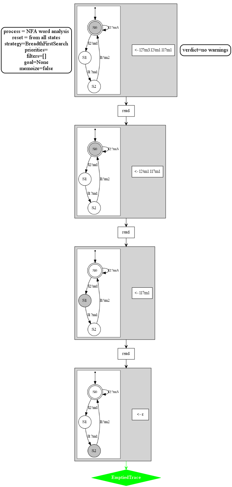
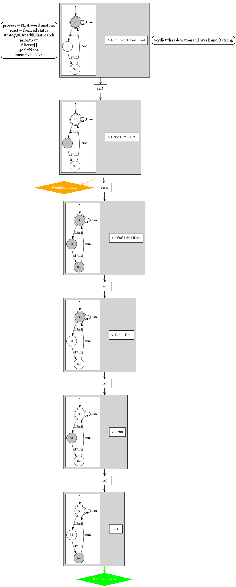
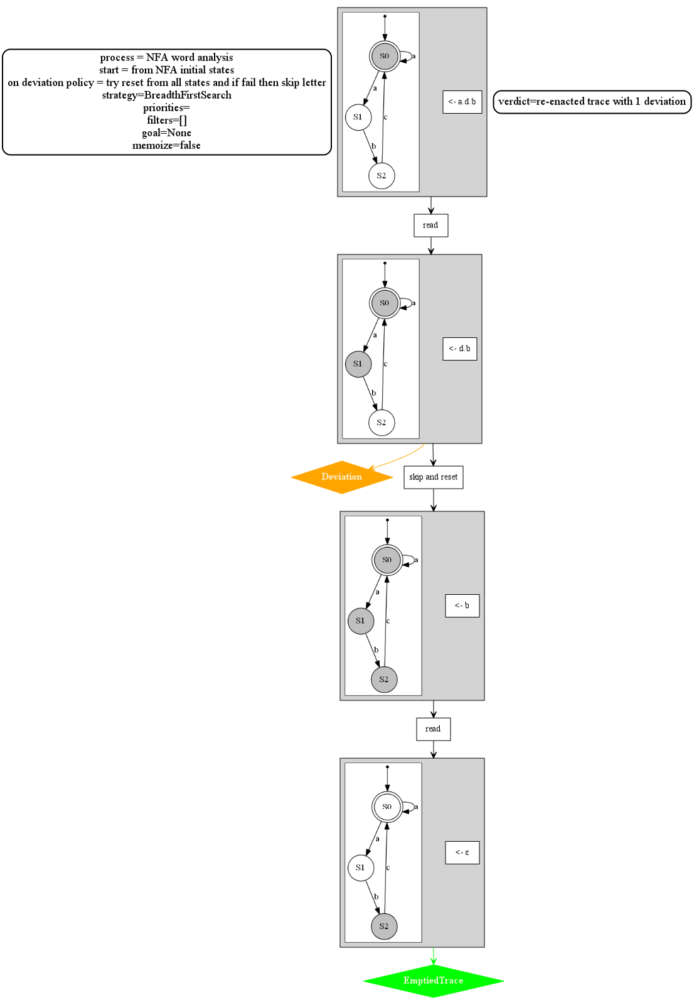

# AUTOmata Utilities and Representation (AUTOUR) 

Some processes / analyses built on top of the
[autour_core](https://crates.io/crates/autour_core) crate.

## Runtime Verification Algorithm from NFA

An algorithm for Runtime Verification against an NFA that acts as a specification of expected behavior.

A word is analyzed from a certain set of starting states.
In the example below we start from the start state of the automata and successfully empty the trace.
No warnings are emitted.

In the example below at one point in the analysis it is impossible to read the next letter.
We perform a *reset* which means that we forget the state in which the system is and suppose 
it can be in any state
(Let us remark that we can configure which states are reset states (here all states are reset states))
A warning is emitted and we may then continue the analysis from that point.

In the third example below, even after the reset, it is impossible to read the next letter.
We therefore *skip* it from the word to analyze and a stronger warning is emitted.

