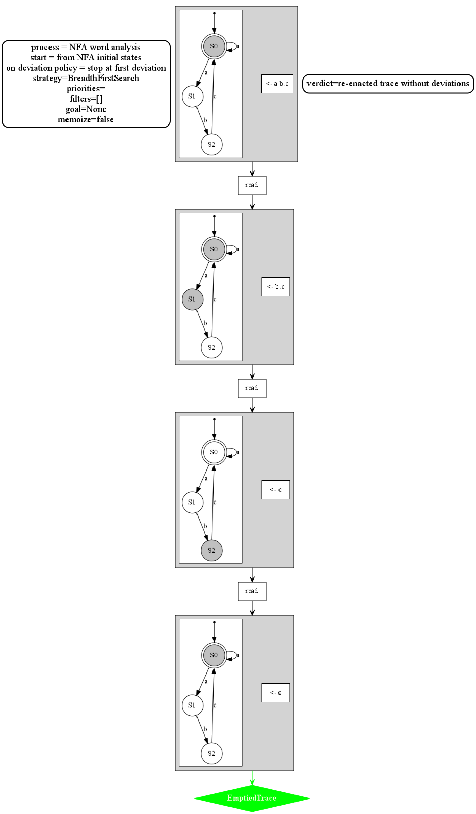
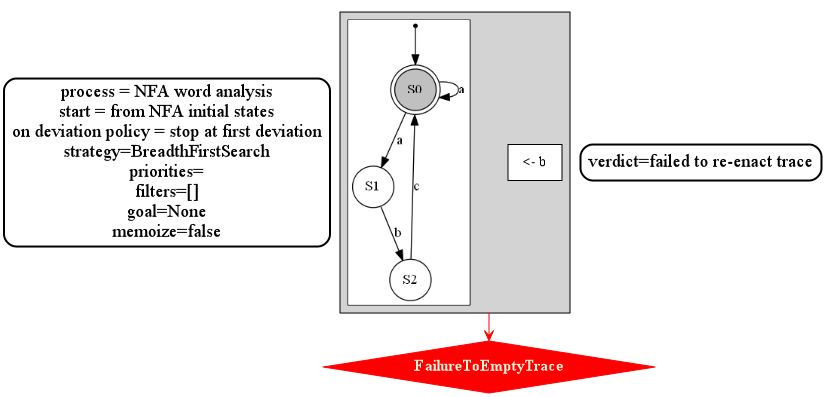
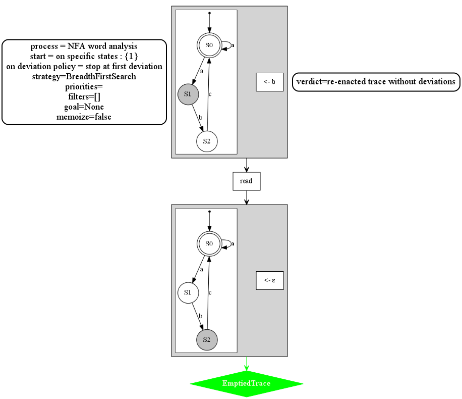
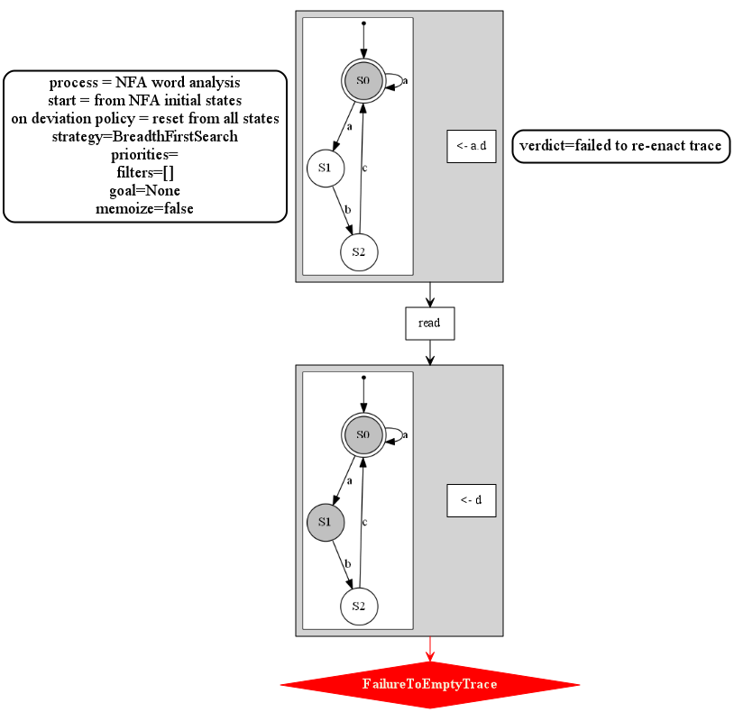

# AUTOmata Utilities and Representation (AUTOUR) 

Some processes / analyses built on top of the
[autour_core](https://crates.io/crates/autour_core) crate.

## Word analysis Algorithm from NFA

An algorithm for analyzing words against a NFA that acts as a specification of expected behavior.

A word is analyzed from a certain set of starting states.
In the example below we start from the start state of the automata and successfully empty the trace.
Letters of the word are read one after the other while the current set of active states changes.
Here the trace is successfully re-enacted and no deviations are observed.

In the case where the next letter to analyze cannot be read from the current active states,
the analysis may fail as in the example below (depending on the parameterization of the algorithm).

It is possible to parameterize the algorithm so that we start, not from the initial state,
but from a different start, to treat more specific scenarios.

In this spirit, we can perform resets when it becomes impossible to read the next letter during the analysis.
Then, the analyzed word might not be recognized as accepted by the language but we can identify sub-words 
that can be recognized as such.

In the example below at one point in the analysis it is impossible to read the next letter.
We perform a *reset* which means that we forget the state in which the system is and suppose 
it can be in any state 
(let us remark that we can configure which states are reset states (here all states are reset states))
A warning of the deviation is emitted and we may then continue the analysis from that point.

Even with resets, it is still possible to be stuck at one point during the analysis.
This occurs when we try to read a letter which does not correspond to any outgoing transition from reset states.

The example below describes this case.

To be able to continue the analysis, we may perform a skip i.e. ignoring the letter.
In the example below it is done at the same time of the first reset.

